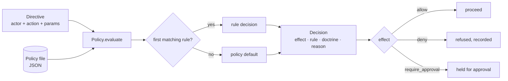

# sentinel-policy

[](https://github.com/cognis-digital/sentinel-policy/actions/workflows/ci.yml)

> Part of the **[Accountable AI Engineering suite](https://github.com/cognis-digital/accountable-ai-suite)** — provable governance for AI agents on infrastructure you own.

**An open governance doctrine for AI agents — the SENTINEL seven rules — plus a file-backed policy-gate engine that decides allow / deny / require-approval, each decision citing the rule it serves.**

Ask yourself:

- Has anyone asked what your AI agents are actually *allowed* to do — and you pointed at a slide, not a file?
- When an action is blocked, can you name **which rule** blocked it, and why?
- Could an auditor read your governance rules and **argue with them** before trusting your agents?

"Responsible AI" means nothing until it's written down as rules you can enforce. `sentinel-policy` publishes a concrete doctrine openly (COCL (Cognis Open Collaboration License)) and ships a small engine that enforces it from a plain JSON policy file — no DSL, no `eval`, no runtime dependency.


## Watch the walkthrough

A full narrated tour — setup, the tool in action, and every demo scenario:

[](https://github.com/cognis-digital/sentinel-policy/releases/download/walkthrough-v1/walkthrough.mp4)

▶ **[Watch the walkthrough (MP4)](https://github.com/cognis-digital/sentinel-policy/releases/download/walkthrough-v1/walkthrough.mp4)**

## The SENTINEL doctrine

Seven rules for governing what an autonomous agent may do in a high-stakes environment. A *sentinel* stands at a boundary, checks authority, and keeps a record:

| | Rule | Statement |
|---|------|-----------|
| **S1** | Attributed Intent | Every action traces to a named, authenticated operator and an explicit directive. |
| **S2** | Least Authority | An agent acts within the narrowest scope that satisfies the directive; outside it is denied by default. |
| **S3** | Gated Escalation | Any action above a risk tier requires a separate, independently authorized approval. |
| **S4** | Immutable Record | Every directive, decision, and outcome is committed to a tamper-evident record before its effect is visible. |
| **S5** | Reversibility Preference | Prefer reversible actions; irreversible ones need explicit acknowledgement and a higher tier. |
| **S6** | Boundary Integrity | Data and credentials don't cross a classification/tenant/network boundary unless explicitly authorized. |
| **S7** | Provable Refusal | A denied or aborted action is recorded with its rule and reason. Silence is not an outcome. |

```bash
sentinel doctrine        # prints all seven with their rationale
```

## Policy as data

A policy is JSON. Each rule cites the doctrine principle it enforces, an effect, and a `match` condition. The first matching rule (by priority, then order) decides; otherwise the policy `default` applies.

```json
{
  "name": "prod-controls",
  "default": "deny",
  "rules": [
    { "id": "reads-are-fine", "doctrine": "S2", "effect": "allow",
      "match": { "action": "read.*" } },
    { "id": "gate-prod-deploy", "doctrine": "S3", "effect": "require_approval", "tier": "high",
      "match": { "action": "deploy", "params.env": { "eq": "prod" } } },
    { "id": "no-cross-boundary-export", "doctrine": "S6", "effect": "deny",
      "match": { "action": "*export*" } }
  ]
}
```

Conditions are pure data — equality, glob, and operators (`in`, `gt`, `exists`, …) over dotted field paths. Because the policy is data, not code, it can be reviewed, diffed, and signed without executing anything.

```bash
sentinel lint policies/example.json
sentinel eval policies/example.json --action deploy --param env=prod
```

```json
{ "decision": { "allowed": false, "effect": "require_approval",
                "rule": "gate-prod-deploy", "doctrine": "S3",
                "obligations": { "approval_required": true, "tier": "high" } } }
```

## In code

```python
from sentinel_policy import load_policy

policy = load_policy("policies/example.json")
decision = policy.evaluate({"action": "deploy", "params": {"env": "prod"}})
decision.allowed          # False
decision.effect.value     # "require_approval"
decision.doctrine         # "S3"
```

## Composes with agentledger

A `Decision` exposes `allowed`, `rule`, and `reason`, so it drops straight into [`agentledger`](https://github.com/cognis-digital/agentledger)'s policy-gate hook — sentinel-policy decides, agentledger signs and records the decision:

```python
from agentledger import Recorder, PolicyGate
from sentinel_policy import load_policy

policy = load_policy("policies/example.json")
gate = PolicyGate(default_allow=False).use(policy.as_gate_evaluator(defer_on_default=False))
rec = Recorder(gate=gate)

decision, entry = rec.submit("alice", "deploy", {"env": "prod"})   # gated + recorded + signed
```

`as_gate_evaluator(defer_on_default=True)` instead returns `None` on the default branch, letting a host gate's own rules take over — so you can layer an org-wide doctrine above a team policy.

## Demos

Five runnable scenarios in [`demos/`](demos/), each for a different audience and
using only the real public API — no network, narrated output, every one exits 0.
See [`docs/DEMOS.md`](docs/DEMOS.md) for the long form and
[`docs/ARCHITECTURE.md`](docs/ARCHITECTURE.md) for the evaluate → verdict flow.

```bash
# Windows console is cp1252; force UTF-8 so the output renders cleanly.
PYTHONUTF8=1 python demos/run_all.py                       # all five
PYTHONUTF8=1 python demos/02_security_least_authority.py   # or just one
```

| # | Demo | Audience | What it shows |
|---|------|----------|----------------|
| 1 | [`01_agent_builder_gate.py`](demos/01_agent_builder_gate.py) | AI-agent builders | Gate each intended action; obey the allow / deny / require-approval verdict, each citing its rule. |
| 2 | [`02_security_least_authority.py`](demos/02_security_least_authority.py) | Security engineers | Scope an agent to one tenant, gate secrets by priority, deny cross-tenant reads. |
| 3 | [`03_compliance_doctrine_coverage.py`](demos/03_compliance_doctrine_coverage.py) | Compliance & audit | Map every rule to the principle it cites; report doctrine coverage. |
| 4 | [`04_platform_layered_policies.py`](demos/04_platform_layered_policies.py) | Platform engineers | Layer an org doctrine above a team policy via `as_gate_evaluator`. |
| 5 | [`05_provable_refusal_log.py`](demos/05_provable_refusal_log.py) | Safety / SRE | Provable Refusal (S7): a structured record for every directive, no silent denials. |



## Testing

```bash
pip install -e ".[dev]"
pytest -q          # 24 tests
```

## License

COCL (Cognis Open Collaboration License). © Cognis Digital. The doctrine is published openly on purpose — fork it, argue with it, tighten it for your regulators.

> Status: v0.1 — runnable and tested. Roadmap: policy composition/inheritance, time-windowed and rate-based conditions, a signed-policy loader (verify a policy file's provenance before enforcing it), and a test harness for asserting doctrine coverage.
