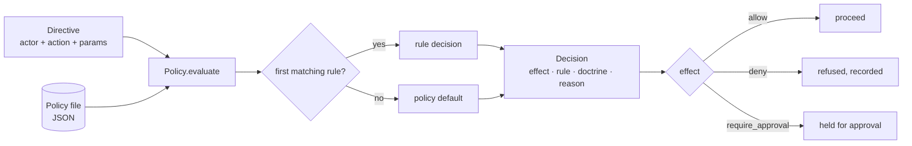

# sentinel-policy

[](https://github.com/cognis-digital/sentinel-policy/actions/workflows/ci.yml)

> Part of the **[Accountable AI Engineering suite](https://github.com/cognis-digital/accountable-ai-suite)** — provable governance for AI agents on infrastructure you own.

**An open governance doctrine for AI agents — the SENTINEL seven rules — plus a file-backed policy-gate engine that decides allow / deny / require-approval, each decision citing the rule it serves.**

Ask yourself:

- Has anyone asked what your AI agents are actually *allowed* to do — and you pointed at a slide, not a file?
- When an action is blocked, can you name **which rule** blocked it, and why?
- Could an auditor read your governance rules and **argue with them** before trusting your agents?

"Responsible AI" means nothing until it's written down as rules you can enforce. `sentinel-policy` publishes a concrete doctrine openly (COCL (Cognis Open Collaboration License)) and ships a small engine that enforces it from a plain JSON policy file — no DSL, no `eval`, no runtime dependency.


## Watch the walkthrough

A full narrated tour — setup, the tool in action, and every demo scenario:

[](https://github.com/cognis-digital/sentinel-policy/releases/download/walkthrough-v1/walkthrough.mp4)

▶ **[Watch the walkthrough (MP4)](https://github.com/cognis-digital/sentinel-policy/releases/download/walkthrough-v1/walkthrough.mp4)**

## The SENTINEL doctrine

Seven rules for governing what an autonomous agent may do in a high-stakes environment. A *sentinel* stands at a boundary, checks authority, and keeps a record:

| | Rule | Statement |
|---|------|-----------|
| **S1** | Attributed Intent | Every action traces to a named, authenticated operator and an explicit directive. |
| **S2** | Least Authority | An agent acts within the narrowest scope that satisfies the directive; outside it is denied by default. |
| **S3** | Gated Escalation | Any action above a risk tier requires a separate, independently authorized approval. |
| **S4** | Immutable Record | Every directive, decision, and outcome is committed to a tamper-evident record before its effect is visible. |
| **S5** | Reversibility Preference | Prefer reversible actions; irreversible ones need explicit acknowledgement and a higher tier. |
| **S6** | Boundary Integrity | Data and credentials don't cross a classification/tenant/network boundary unless explicitly authorized. |
| **S7** | Provable Refusal | A denied or aborted action is recorded with its rule and reason. Silence is not an outcome. |

```bash
sentinel doctrine        # prints all seven with their rationale
```

## Policy as data

A policy is JSON. Each rule cites the doctrine principle it enforces, an effect, and a `match` condition. The first matching rule (by priority, then order) decides; otherwise the policy `default` applies.

```json
{
  "name": "prod-controls",
  "default": "deny",
  "rules": [
    { "id": "reads-are-fine", "doctrine": "S2", "effect": "allow",
      "match": { "action": "read.*" } },
    { "id": "gate-prod-deploy", "doctrine": "S3", "effect": "require_approval", "tier": "high",
      "match": { "action": "deploy", "params.env": { "eq": "prod" } } },
    { "id": "no-cross-boundary-export", "doctrine": "S6", "effect": "deny",
      "match": { "action": "*export*" } }
  ]
}
```

Conditions are pure data over dotted field paths — no `eval`, no expression language. The operator set covers equality/sets (`eq`, `ne`, `in`, `nin`, `contains`, `subset`, `superset`), text (`glob`, `regex`, `startswith`, `endswith`), numbers (`gt`, `ge`, `lt`, `le`, `between`), presence/size (`exists`, `len_eq`, `len_gt`, `len_lt`), **network** (`cidr`), **time** (`time_window`, wrapping past midnight), and logical composition (`all_`, `any_`, `not_`). Every operator is *total*: a malformed value fails closed, it never raises — a governance gate fails closed, not crashes.

```json
{ "action": { "regex": "^deploy(\\.|$)" },
  "src.ip": { "cidr": "10.0.0.0/8" },
  "params.clock": { "time_window": "09:00-17:00" },
  "scopes": { "superset": ["billing:write"] } }
```

```bash
sentinel lint policies/example.json
sentinel eval policies/example.json --action deploy --param env=prod
sentinel explain policies/example.json --action deploy --param env=prod   # full reasoning trace
sentinel report policies/example.json          # lint + doctrine coverage + shape
sentinel diff old.json new.json                # what changed; flags a loosening
sentinel replay decisions.jsonl                # aggregate a decision log
sentinel export policies/example.json --format rego   # or yaml / json
sentinel ci policies/example.json --min-coverage 40 --baseline old.json --fail-on-loosen
```

```json
{ "decision": { "allowed": false, "effect": "require_approval",
                "rule": "gate-prod-deploy", "doctrine": "S3",
                "obligations": { "approval_required": true, "tier": "high" } } }
```

## In code

```python
from sentinel_policy import load_policy

policy = load_policy("policies/example.json")
decision = policy.evaluate({"action": "deploy", "params": {"env": "prod"}})
decision.allowed          # False
decision.effect.value     # "require_approval"
decision.doctrine         # "S3"

# Dry-run: get the full reasoning path, not just the verdict.
trace = policy.explain({"action": "deploy", "params": {"env": "prod"}})
trace.decided_by          # "gate-prod-deploy"
print(trace.render())     # every rule considered, which matched, and why

# Diff two policy versions and gate a release on it.
from sentinel_policy import diff_policies, build_report, AuditLog, RateLimiter, to_yaml
diff = diff_policies(old_policy, policy)
diff.loosens_control      # True if the change newly permits something

# One report to lint + measure doctrine coverage + spot dead rules.
build_report(policy).coverage_pct    # 57.1

# Every decision is a durable JSONL record you can replay.
with AuditLog("decisions.jsonl") as log:
    log.write_many(policy, directives)

# A frequency ceiling on top of the allow/deny verdict.
RateLimiter(limit=3, window=60).check("alice:deploy").allowed

# Export the same rules to YAML (authoring) or OPA Rego (review).
print(to_yaml(policy))
```

## Composes with agentledger

A `Decision` exposes `allowed`, `rule`, and `reason`, so it drops straight into [`agentledger`](https://github.com/cognis-digital/agentledger)'s policy-gate hook — sentinel-policy decides, agentledger signs and records the decision:

```python
from agentledger import Recorder, PolicyGate
from sentinel_policy import load_policy

policy = load_policy("policies/example.json")
gate = PolicyGate(default_allow=False).use(policy.as_gate_evaluator(defer_on_default=False))
rec = Recorder(gate=gate)

decision, entry = rec.submit("alice", "deploy", {"env": "prod"})   # gated + recorded + signed
```

`as_gate_evaluator(defer_on_default=True)` instead returns `None` on the default branch, letting a host gate's own rules take over — so you can layer an org-wide doctrine above a team policy.

## Demos

Eleven runnable scenarios in [`demos/`](demos/), each for a different audience and
using only the real public API — no network, narrated output, every one exits 0.
See [`docs/DEMOS.md`](docs/DEMOS.md) for the long form and
[`docs/ARCHITECTURE.md`](docs/ARCHITECTURE.md) for the evaluate → verdict flow.

```bash
# Windows console is cp1252; force UTF-8 so the output renders cleanly.
PYTHONUTF8=1 python demos/run_all.py                       # all eleven
PYTHONUTF8=1 python demos/02_security_least_authority.py   # or just one
```

| # | Demo | Audience | What it shows |
|---|------|----------|----------------|
| 1 | [`01_agent_builder_gate.py`](demos/01_agent_builder_gate.py) | AI-agent builders | Gate each intended action; obey the allow / deny / require-approval verdict, each citing its rule. |
| 2 | [`02_security_least_authority.py`](demos/02_security_least_authority.py) | Security engineers | Scope an agent to one tenant, gate secrets by priority, deny cross-tenant reads. |
| 3 | [`03_compliance_doctrine_coverage.py`](demos/03_compliance_doctrine_coverage.py) | Compliance & audit | Map every rule to the principle it cites; report doctrine coverage. |
| 4 | [`04_platform_layered_policies.py`](demos/04_platform_layered_policies.py) | Platform engineers | Layer an org doctrine above a team policy via `as_gate_evaluator`. |
| 5 | [`05_provable_refusal_log.py`](demos/05_provable_refusal_log.py) | Safety / SRE | Provable Refusal (S7): a structured record for every directive, no silent denials. |
| 21 | [`21_new_condition_operators.py`](demos/21_new_condition_operators.py) | Security engineers | `regex` / `cidr` / `time_window` / set / `not_` operators deciding real directives, each failing closed. |
| 22 | [`22_explain_trace.py`](demos/22_explain_trace.py) | Governance / audit | `Policy.explain()` — the full reasoning trace behind a verdict (dry run). |
| 23 | [`23_policy_diff.py`](demos/23_policy_diff.py) | Platform / release | `diff_policies()` — added / removed / changed rules and a `loosens_control` gate signal. |
| 24 | [`24_audit_replay.py`](demos/24_audit_replay.py) | Audit | `AuditLog` (append-only JSONL) + `replay()` back into an auditable summary. |
| 25 | [`25_rate_limit.py`](demos/25_rate_limit.py) | SRE / platform | Sliding-window `RateLimiter` — a ceiling on how often, per actor+action. |
| 26 | [`26_ci_gate_and_export.py`](demos/26_ci_gate_and_export.py) | CI / platform | `build_report` CI gate + `to_yaml` / `to_rego` export of the same rules. |



## Testing

```bash
pip install -e ".[dev]"
pytest -q          # 113 tests
```

## License

COCL (Cognis Open Collaboration License). © Cognis Digital. The doctrine is published openly on purpose — fork it, argue with it, tighten it for your regulators.

> Status: v0.2 — runnable and tested (113 tests, 11 demos). Now shipping: an explain/dry-run reasoning trace, policy diffing with a loosening-detection release gate, a JSONL decision-audit log + replay, a combined lint/coverage/dead-rule report and a `sentinel ci` gate, richer condition operators (`regex` / `cidr` / `time_window` / set membership / logical composition), a sliding-window rate limiter, and YAML / OPA-Rego import-export. Roadmap: policy composition/inheritance and a signed-policy loader (verify a policy file's provenance before enforcing it).
