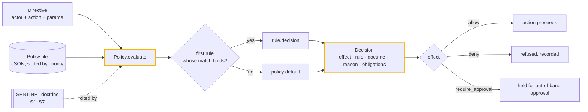
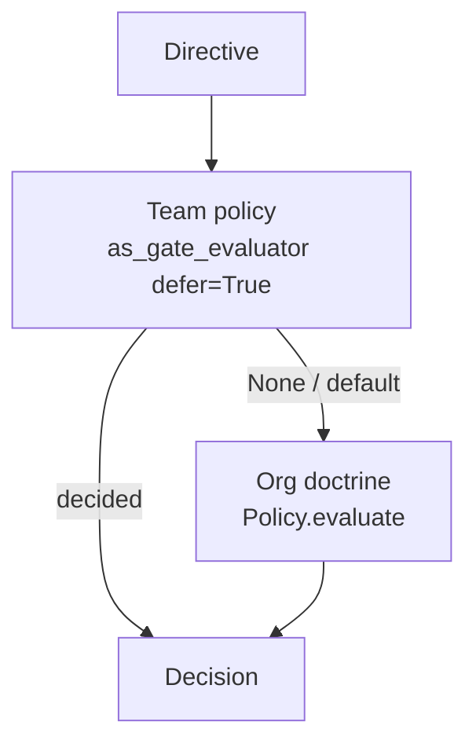

# Architecture

`sentinel-policy` is two things that fit together: an **open doctrine** (the
SENTINEL seven rules, published as data) and a **decision-only policy engine**
that turns a file-backed policy into `allow` / `deny` / `require_approval`
verdicts — each verdict citing the doctrine rule it serves. There is no DSL, no
`eval`, no daemon, and no runtime dependency: a policy is plain JSON, and
evaluating it is a pure function.

## The evaluate → verdict flow

A directive is a dict (`actor`, `action`, `params`). The engine walks the
rules — already sorted by descending priority, ties broken by declaration order
— and the **first rule whose `match` condition holds** decides. If none match,
the policy's `default` effect applies. Either way you get a `Decision`, never a
silent pass.

## Components

### Doctrine (`sentinel_policy/doctrine.py`)
Seven `Rule` dataclasses (`S1`..`S7`), exported as the immutable tuple
`DOCTRINE` and looked up by id via `rule("S3")`. The doctrine is the published
"why": every policy rule names the principle it enforces, so any decision is
traceable to a stated principle rather than a vibe. A module-level assertion
fails fast if the doctrine is ever edited into fewer/more than seven unique
rules.

### Conditions (`sentinel_policy/conditions.py`)
A small, safe matcher. A rule's `match` is a mapping of **dotted field path** →
**expected**, where expected is a scalar (equality, or glob if it contains
wildcards) or an operator object: `eq`, `ne`, `in`, `nin`, `glob`, `contains`,
`exists`, `gt`, `ge`, `lt`, `le`. All entries in a match must hold (logical
AND). No expression language and no `eval` — policies are data you can review,
diff, and sign without executing anything.

### Policy engine (`sentinel_policy/policy.py`)
- **`Effect`** — `allow` / `deny` / `require_approval`.
- **`Decision`** — frozen result: `effect`, `rule`, `doctrine`, `reason`,
  `obligations`, plus the `allowed` property (only an explicit `allow` is
  truthy) and `as_dict()`.
- **`Policy`** — holds the sorted rules and default; `evaluate(directive)`
  returns a `Decision`; `validate()` reports problems (duplicate ids, unknown
  doctrine references, unknown operators) for `sentinel lint`.
- **`as_gate_evaluator(defer_on_default=...)`** — returns a `Callable` for
  composition. With `defer_on_default=True` it returns `None` when only the
  default applied, letting a host gate decide — so you can stack an org doctrine
  above a team policy (see demo 4).
- **`load_policy(path)`** — read a JSON policy from disk.

### CLI (`sentinel_policy/cli.py`)
`sentinel doctrine` prints the seven rules; `sentinel lint POLICY.json`
validates a file; `sentinel eval POLICY.json --action … --param k=v` evaluates a
directive and prints the decision as JSON (exit 0 if allowed, 2 otherwise).

## Composability

Because a policy compiles to a pure evaluator, layering is just function
composition: doctrine → org → team, no framework required. The same `Decision`
shape (`.allowed`, `.rule`, `.reason`, `.as_dict()`) drops straight into
[`agentledger`](https://github.com/cognis-digital/agentledger)'s `PolicyGate`
hook — sentinel-policy decides, agentledger signs and records.

## Why these choices

- **Policy as data, not code.** Reviewable, diffable, signable; no `eval`, no
  arbitrary execution at enforcement time.
- **Decision-only, dependency-free.** The engine never performs the action and
  never reaches the network — it only renders a verdict, so it drops into any
  host without pulling in a stack.
- **Every verdict cites a published rule.** Provable Refusal (S7) is structural:
  even the default branch returns a named `Decision`. Silence is never an
  outcome.
